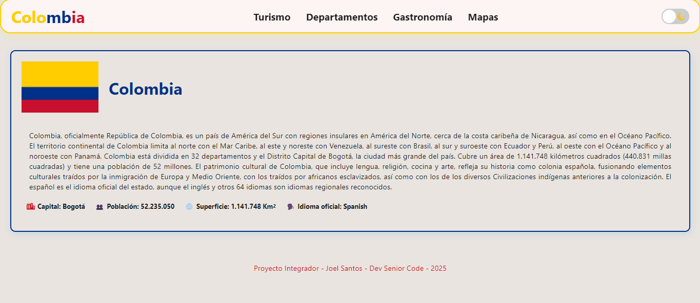
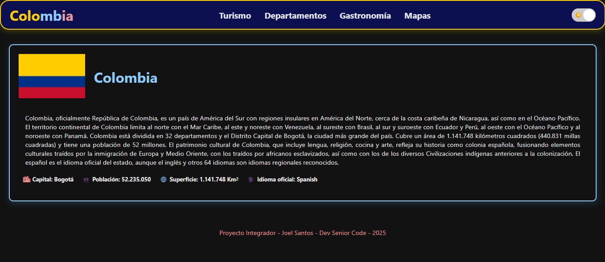

<h1>Proyecto Integrador - Dev senior Code 2025</h1>

<h2>Descripcion general</h2>
<p>
  En este proyecto integrador,  se desarrollos una aplicación web dinámica
  e interactiva que consume datos de APIs públicas. El objetivo es consolidar 
  todos los conocimientos adquiridos durante el Módulo 1: Web Foundations & Coding Skills.
</p>
<hr>
<h3>Link del proyecto</h3>
 https://joelsantosdev-code.github.io/proyecto-integrador/

**Descubre Colombia** es una aplicación web interactiva que permite explorar información detallada sobre Colombia, incluyendo sus departamentos, atracciones turísticas, gastronomía típica y mapas. El proyecto consume datos de la [API de Colombia](https://api-colombia.com/) para ofrecer una experiencia dinámica y educativa.

Este proyecto integrador consolida los conocimientos adquiridos en el **Módulo 1: Web Foundations & Coding Skills** de Dev senior Code, demostrando habilidades en:
- Consumo de APIs REST
- Manipulación del DOM
- Diseño responsive
- Manejo de eventos
- Almacenamiento local (LocalStorage)

## 🎯 Características Principales

### ✨ Funcionalidades

- **🌍 Información General**: Datos generales sobre Colombia (bandera, población, superficie, capital)
- **🏛️ Departamentos**: Lista completa de los 32 departamentos con información demográfica
- **🏖️ Turismo**: Principales atracciones turísticas del país
- **🍲 Gastronomía**: Platos típicos con sus ingredientes y departamento de origen
- **🗺️ Mapas**: Mapas interactivos de diferentes regiones

### 🎨 Diseño y UX

- **Tema Claro/Oscuro**: Switch para alternar entre modos con persistencia en LocalStorage
- **Diseño Responsive**: Adaptado para móvil, tablet y desktop
- **Menú Hamburguesa**: Sidebar deslizable en versiones móviles
- **Modal de Imágenes**: Visualización de imágenes en tamaño completo
- **Animaciones Suaves**: Transiciones y efectos hover
- **Cards Interactivas**: Información organizada en tarjetas visuales

## 🖼️ Vista Previa

### Modo Claro


### Modo Oscuro


## 📡 APIs Consumidas

El proyecto utiliza la [API de Colombia](https://api-colombia.com/), consumiendo los siguientes endpoints:

```javascript
https://api-colombia.com/api/v1/Country/Colombia      // Información general
https://api-colombia.com/api/v1/Department            // Departamentos
https://api-colombia.com/api/v1/TouristicAttraction   // Atracciones turísticas
https://api-colombia.com/api/v1/TypicalDish          //Gastronomía típica
https://api-colombia.com/api/v1/Map                   // Mapas
```

---

## 📂 Estructura del Proyecto

```
proyecto-integrador/
│
├── index.html          # Estructura HTML principal
├── styles.css          # Estilos y diseño responsive
├── index.js            # Lógica JavaScript y consumo de APIs
├── README.md           # Documentación del proyecto
│
├── assets/             # Recursos multimedia
│   ├── moon.svg        # Icono tema oscuro
│   ├── sun.svg         # Icono tema claro
│   ├── flag-co.png     # Bandera de Colombia
│   └── preview-*.png   # Capturas de pantalla
│
└── .gitignore          # Archivos ignorados por Git
```
---
## 💡 Funcionalidades Detalladas

### 🌓 Sistema de Temas

```javascript
// Cambio de tema con persistencia
toggle.addEventListener("change", () => {
  if (toggle.checked) {
    document.documentElement.setAttribute("data-theme", "dark");
    localStorage.setItem("theme", "dark");
  } else {
    document.documentElement.setAttribute("data-theme", "light");
    localStorage.setItem("theme", "light");
  }
});
```

### 🔄 Carga Dinámica de Datos

El proyecto implementa funciones modulares para cada sección:

- `cargarGeneral()` - Información del país
- `cargarDepartamentos()` - Lista de departamentos
- `cargarTurismo()` - Atracciones turísticas
- `cargarGastronomia()` - Platos típicos
- `cargarMapas()` - Mapas regionales

### 🖼️ Modal de Imágenes

Click en cualquier imagen para verla en tamaño completo con:
- Animación de zoom
- Cierre con tecla ESC
- Click fuera de la imagen para cerrar
- Botón X para cerrar
---
### Media Queries Implementadas

```css
/* Móvil */
@media (max-width: 640px) { ... }

/* Tablet */
@media (min-width: 641px) and (max-width: 1023px) { ... }

/* Desktop */
@media (min-width: 1024px) { ... }
```

---
## 🔮 Futuras Mejoras

- [ ] Implementar búsqueda y filtrado de contenido
- [ ] Agregar animaciones más complejas con GSAP
- [ ] Integrar mapas interactivos con Leaflet.js
- [ ] Añadir sistema de favoritos
- [ ] Implementar internacionalización (i18n)
- [ ] Agregar modo offline con Service Workers
- [ ] Optimizar carga de imágenes con lazy loading

---
## 👨‍💻 Autor

**Joel Santos**

- GitHub: [@joelsantosdev-code](https://github.com/joelsantosdev-code)
- Email: tu-email@ejemplo.com

---

---
## 🙏 Agradecimientos

- **Dev Senior Code** por la formación y mentoría
- **API Colombia** por proporcionar los datos públicos
- Comunidad de desarrolladores por recursos y documentación

---

## 📞 Contacto y Soporte

¿Tienes preguntas o sugerencias? 

- 📧 Email: joelsantfer@gmail.com
- 💬 Issues: [Reportar un problema](https://github.com/joelsantosdev-code/proyecto-integrador/issues)
- ⭐ Si te gustó el proyecto, ¡dale una estrella!

---